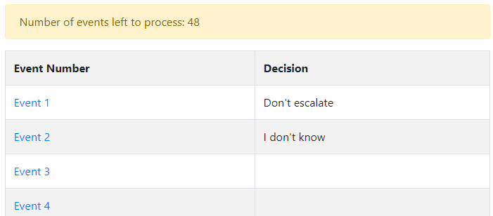
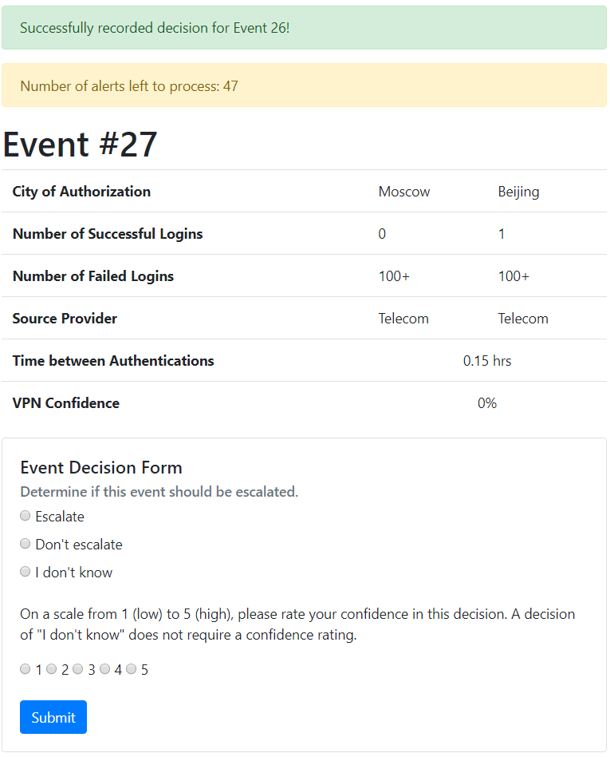
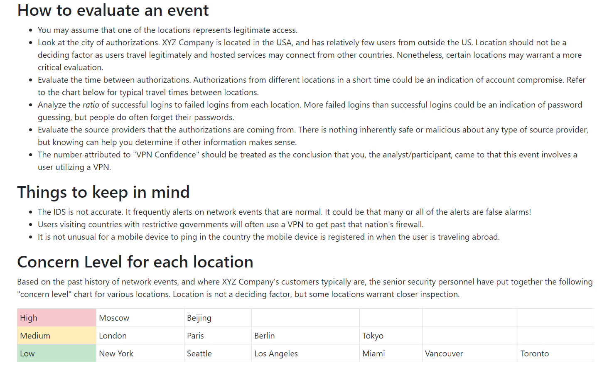

# The Cry Wolf IDS Simulator
Cry Wolf provides an environment for conducting controlled experiments of cyber security analysis tasks. Cry Wolf supports studying the impact of *IDS false alarm rate* on human analyst's ability to correctly classify simulated alerts. 

You can read more

Please contact Lucas Layman (laymanl@uncw.edu) If you are interested in using Cry Wolf.

# Screenshots
## Alert Table

The main alert table. Event numbers are links to alert details.

# Alert Evalation Form

The alert details screen and evaluation form. Participants select their decision and a confidence rating. A confidence rating is not required for "I don't know" answers.

# Security Playbook

The Security Playbook shown to participants during training and available during the main alert evaluation task.

# Training Event
 Open the Security Playbook, 2) Read over the network event details with a table of alert data")
 Evaluate the event with rationale, 4) MAke your decision with a decision form")

An example training event.
